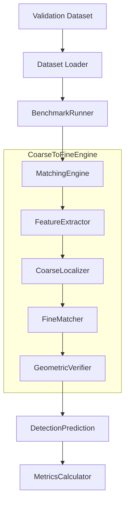

# Architecture

This document describes the complete architecture of the benchmark framework for the TEKNOFEST One-Shot Object Matching problem.

## High-Level Data Flow

## Module Responsibilities

All abstract modules shown in the diagram now exist as fully defined interfaces.

### BenchmarkRunner
- **Responsibility**: Orchestrates the benchmark execution.
- **Rules**: Never performs matching itself. Never computes metrics directly. It handles the looping over the dataset and invoking the engine.
- **Dependencies**: Depends on `MatchingEngine` interface and dataset models.

### MatchingEngine
- **Responsibility**: Abstract interface that defines the contract for a complete matching algorithm. Concrete engines (like `CoarseToFineEngine`) own the extraction, localization, matching, and verification phases.
- **Dependencies**: Depends on abstract components (FeatureExtractor, Localizer, Matcher, Verifier).

### FeatureExtractor
- **Responsibility**: Extracts semantic features from both reference and test images.
- **Data Flow**: Image -> Features
- **Status**: Interface Complete. (Next implementation: DINOv2)

### CoarseLocalizer
- **Responsibility**: Finds candidate regions within the test frame using semantic similarity (e.g., comparing features).
- **Data Flow**: Test Features + Reference Features -> Candidate Region
- **Status**: Interface Complete.

### FineMatcher
- **Responsibility**: Performs geometric local feature matching within the localized candidate region.
- **Data Flow**: Candidate Region (Image) -> Keypoint Matches
- **Status**: Interface Complete. (Next implementation: ALIKED + LightGlue)

### GeometricVerifier
- **Responsibility**: Estimates the geometric transformation between reference and candidate region matches, rejecting false positives. Produces the final bounding box.
- **Data Flow**: Keypoint Matches -> Transformation -> DetectionPrediction (Bounding Box)
- **Status**: Interface Complete. (Next implementation: RANSAC)

### MetricsCalculator
- **Responsibility**: Evaluates the `DetectionPrediction` objects against ground truth annotations (CVAT XML).
- **Data Flow**: Predictions + Ground Truth -> IoU, Precision, Recall, mAP.
- **Status**: Placeholder Complete.

## Interaction & Extensibility

By utilizing the Strategy Pattern and Dependency Injection, researchers can swap out `FeatureExtractor` (e.g., from DINOv2 to another ViT) without altering the `CoarseLocalizer` or the `BenchmarkRunner`. 
The framework is completely independent of specific machine learning libraries at the abstraction layer.
