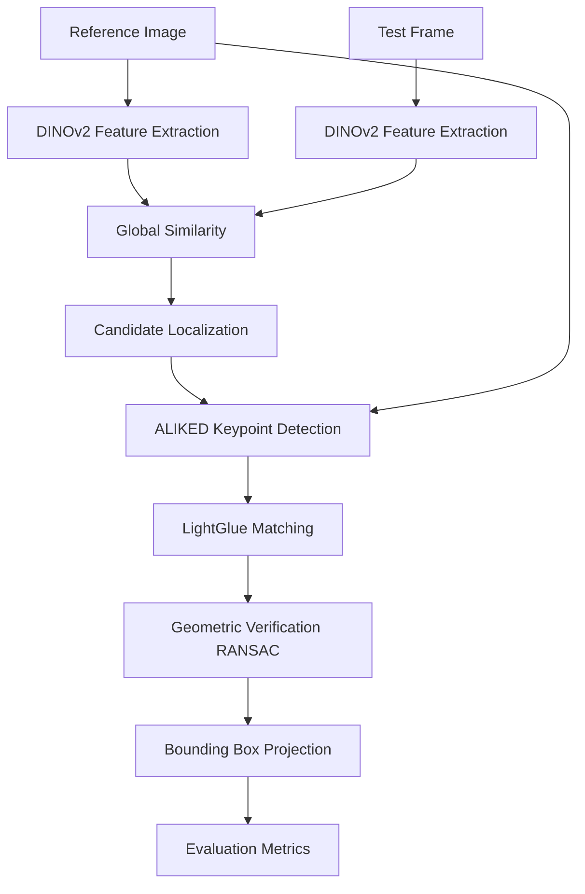

# Pipeline

This document describes the complete target Coarse-to-Fine pipeline for the matching engine.

## Complete Target Pipeline

## Pipeline Implementation Status & Unified Processing

**Important Note:** The benchmark supports BOTH RGB and Thermal images using ONE unified pipeline. Separate models for RGB and Thermal will NOT exist. Both modalities will pass through the exact sequence described below.

Currently, all the **abstract interfaces** for the pipeline below are fully implemented. The actual concrete neural networks (DINOv2, ALIKED, LightGlue) are pending implementation.

## Pipeline Stages Explained

1. **DINOv2 Feature Extraction** *(Interface Implemented, Concrete Pending)*: Both the reference image and the test frame are passed through a DINOv2 vision transformer to extract dense, high-level semantic features.
2. **Global Similarity** *(Pending)*: The extracted feature maps are compared (e.g., via cosine similarity) to identify regions in the test frame most semantically similar to the reference object.
3. **Candidate Localization** *(Interface Implemented, Concrete Pending)*: Based on the similarity heatmap, a coarse bounding box (candidate region) is cropped from the test frame, discarding irrelevant background context.
4. **ALIKED Keypoint Detection** *(Interface Implemented, Concrete Pending)*: High-quality local keypoints and descriptors are extracted from both the reference image and the cropped candidate region using ALIKED.
5. **LightGlue Matching** *(Interface Implemented, Concrete Pending)*: LightGlue matches the ALIKED keypoints between the reference image and the candidate region robustly.
6. **Geometric Verification (RANSAC)** *(Interface Implemented, Concrete Pending)*: OpenCV's RANSAC algorithm filters out mismatched keypoints and estimates the geometric transformation (homography) between the objects.
7. **Bounding Box Projection** *(Interface Implemented, Concrete Pending)*: The transformation is used to project the reference bounding box onto the candidate region, yielding the final object location.
8. **Evaluation Metrics** *(Placeholder Implemented, Concrete Pending)*: The `MetricsCalculator` compares this final bounding box to the ground truth to calculate IoU and other metrics.
